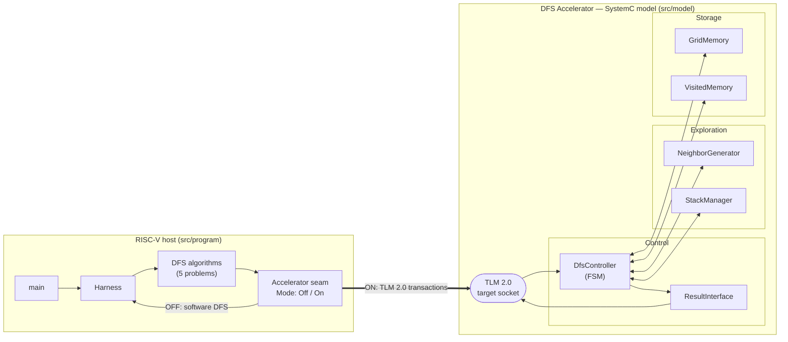
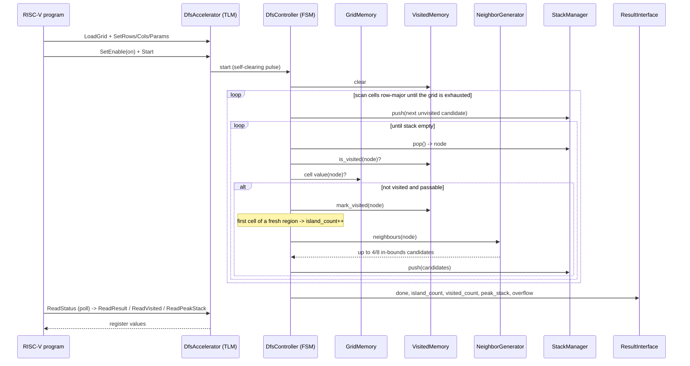

# DFS RISC-V Hardware Accelerator

> Academic project — MP6160 Diseño de Alto Nivel de Sistemas Electrónicos, Instituto Tecnológico de Costa Rica

A high-level model of a RISC-V processor with hardware acceleration for *Depth-First Search* (DFS) over 2D matrices, built with **SystemC**.

**Team:** Gabriel Abarca Aguilar, Jesús Alberto Castro Murillo, José Fabio Jaramillo Cordero, Moisés Leiva Solano, Noel Antonio Pérez Cáceres

---

## Table of Contents

- [Requirements & Build Instructions](#requirements--build-instructions)
- [Repository Organization](#repository-organization)
- [Module Organization](#module-organization)
- [Block Diagram](#block-diagram)
- [Sequence Diagram](#sequence-diagram)
- [Transaction Format](#transaction-format)
- [Memory Map](#memory-map)
- [Results](#results)
- [AI-Assisted Development](#ai-assisted-development)

---

## Requirements & Build Instructions

### Dev container (recommended)

The repository ships a dev container with all dependencies preinstalled, including a pre-compiled SystemC 2.3.4.

**VS Code:**
1. Install the [Dev Containers](https://marketplace.visualstudio.com/items?itemName=ms-vscode.remote-containers) extension
2. Open the repository and select **Reopen in Container**

**Docker CLI:**
```bash
docker build -t dfs-riscv .devcontainer/
docker run -it --rm -v $(pwd):/workspace -w /workspace dfs-riscv make run
```

**GitHub Codespaces:** the same `devcontainer.json` works out of the box.

### Local build

Each part of the project is its own sub-build, with its own toolchain. The root `Makefile` just delegates:

| Target | What it builds | Toolchain |
|---|---|---|
| `make model` | `src/model/` — the SystemC simulation (`sim`) | host C++ compiler (GCC ≥ 9 / Clang ≥ 10, C++17) + CMake ≥ 3.16 |
| `make program` | `src/program/` — the bare-metal RISC-V binary | `riscv64-unknown-elf-gcc`/`g++` (cross-compiler) + CMake ≥ 3.16 |
| `make integration` | `src/program/` (native) — co-simulates the RISC-V software against the real `DfsAccelerator` over TLM and cross-checks every algorithm's ON result against its OFF baseline | host C++ compiler + CMake + **an installed SystemC** (see note below) |
| `make paper` | `docs/paper/main.pdf` | `latexmk`/`pdflatex`/`bibtex` |

```bash
git clone <repository-url>
cd <repository>
make              # builds model + program
make run          # builds both and runs sim, passing it the program binary as a parameter
make integration  # builds and runs the program<->model co-simulation cross-check
make clean        # cleans model + program build dirs
make paper        # builds docs/paper/main.pdf
make paper-clean  # removes LaTeX build artifacts
```

If SystemC is already installed, export `SYSTEMC_HOME` before `make` to skip the download. The RISC-V cross-compiler is only available inside the dev container (see below) — it doesn't install automatically.

`make integration` specifically needs `SYSTEMC_HOME` pointing at an **installed** SystemC (headers under `$SYSTEMC_HOME/include`, library under `$SYSTEMC_HOME/lib`) — unlike `make model`, it does not auto-fetch one. The dev container already has this set up. Building locally without it: run `make model` once (which fetches and builds SystemC via CMake `FetchContent` under `src/model/build/_deps/systemc-build`), then `cmake --install src/model/build --prefix <some-dir>` and export `SYSTEMC_HOME=<some-dir>` before `make integration`.

### CI/CD

- [`build.yml`](.github/workflows/build.yml): on every push/PR touching `src/`, `Makefile`, or `.devcontainer/`, builds the model and the program, runs the simulation, and verifies the program **both** under RISC-V emulation (qemu) and as a native build.
- [`paper.yml`](.github/workflows/paper.yml): compiles the LaTeX paper (`docs/paper/`) on every push to `main` and every PR that modifies it (PDF uploaded as an artifact); on PRs it also runs an **AI-writing gate** (see below).

See the [CI/CD guide](docs/guides/ci-cd.md) for flow diagrams and how each step verifies.

---

## Repository Organization

```
.
├── .devcontainer/
│   ├── Dockerfile                 # Linux image with SystemC pre-built
│   └── devcontainer.json          # Dev container config (VS Code / Codespaces)
├── .github/
│   ├── skills/
│   │   └── log-ai.md              # Claude Code skill to log AI usage
│   └── workflows/
│       ├── build.yml              # CI: builds and runs the SystemC simulation
│       └── paper.yml              # CI: compiles the LaTeX paper
├── docs/
│   └── paper/
│       ├── main.tex                # Scientific paper (IEEE format)
│       ├── refs.bib                # Bibliography
│       ├── .gitignore               # LaTeX build artifacts
│       └── Makefile                 # Builds main.pdf via latexmk
├── src/
│   ├── model/                      # SystemC hardware model (host C++)
│   │   ├── config/                 # accelerator_config, memory_map, tlm_protocol
│   │   ├── modules/                 # one SystemC module per HW component
│   │   ├── utils/                   # SystemC value types (types.h)
│   │   ├── sc_main.cpp              # sc_main — instantiates the accelerator top-level
│   │   ├── CMakeLists.txt           # Builds sim; auto-fetches SystemC if needed
│   │   └── Makefile                 # Thin CMake wrapper
│   └── program/                    # bare-metal C++ program run by the simulated RISC-V core
│       ├── algorithms/              # one folder per DFS algorithm (5 problems)
│       ├── cases/                   # test-case format + hand-written datasets
│       ├── harness/                 # case runner, metrics, accelerator ON/OFF seam
│       ├── dfs_types.h              # shared software value types
│       ├── main.cpp                 # entry point — drives the harness
│       ├── riscv-toolchain.cmake    # CMake toolchain file for the RISC-V cross-compiler
│       ├── CMakeLists.txt           # Builds the bare-metal binary
│       └── Makefile                 # Thin CMake wrapper
├── Makefile                       # Delegates to src/model, src/program, docs/paper
└── README.md
```

---

## Module Organization

The project has two halves that meet at a TLM 2.0 interface: a **software baseline**
that runs on the simulated RISC-V core, and the **SystemC hardware model** of the
accelerator it can offload to.

### Software — `src/program/`

Bare-metal C++ compiled for RISC-V. Each DFS problem implements a common
interface so the harness can run them uniformly, once with the accelerator OFF
(pure software) and once ON (primitives offloaded).

| Component | Path | Responsibility |
|---|---|---|
| DFS algorithms | `algorithms/<problem>/` | The five LeetCode DFS problems as free functions (+ no-pruning / no-memo variants) |
| Algorithm registry | `algorithms/dfs_algorithm.h` | `AlgoEntry` registry + `make_algorithms()` — the test bench that calls each function |
| Accelerator seam | `harness/accelerator.h` | `Mode::{Off,On}` abstraction over the DFS primitives |
| Harness | `harness/harness.{h,cpp}` | Runs every case × mode, validates, records metrics |
| Metrics | `harness/metrics.h` | `RunMetrics` (latency, instr. count, throughput, …) |
| Test cases | `cases/test_case.h` + `cases/datasets.cpp` | `Problem` (algorithm input) + `TestCase` (`Problem` + expected) + embedded datasets |

> **How it runs:** see the [software pipeline guide](docs/guides/software-pipeline.md)
> for the pipeline flow diagram, the step-by-step walkthrough, and build/run instructions.

### Hardware — `src/model/`

The accelerator is a SystemC top-level module (`DfsAccelerator`) exposing one TLM
2.0 target socket. Internally it is split into three stages — **control**,
**exploration**, and **storage** — matching the paper's proposed architecture.

| Stage | Module | Path | Responsibility |
|---|---|---|---|
| Top-level | `DfsAccelerator` | `modules/dfs_accelerator.h` | TLM socket, host-transaction decode, module interconnect |
| Control | `DfsController` | `modules/dfs_controller.h` | FSM driving the traversal without CPU intervention |
| Control | `ResultInterface` | `modules/result_interface.h` | Latches the result once `done`, so a host reading it can never race an in-flight run |
| Exploration | `NeighborGenerator` | `modules/neighbor_generator.h` | 4/8 neighbours of a cell with boundary handling |
| Exploration | `StackManager` | `modules/stack_manager.h` | LIFO of unexplored nodes; peak-depth tracking |
| Storage | `GridMemory` | `modules/grid_memory.h` | Read-only input grid |
| Storage | `VisitedMemory` | `modules/visited_memory.h` | Per-cell visited state, cleared per run |

> **Status:** all modules are implemented and verified end to end — `make integration`
> co-simulates the real RISC-V software against this real `DfsAccelerator` (not a
> mock) over TLM and cross-checks every algorithm's accelerator-ON result against
> its software-OFF baseline. `DfsController` performs a **multi-source** scan
> (row-major over the whole grid, one flood-fill per unvisited passable cell),
> matching real "number of islands" semantics on the register/whole-traversal
> path; the other four algorithms are exercised through the fine-grained
> primitive path (`is_visited`/`mark_visited`/`neighbours`), bridged onto the same
> `GridMemory`/`VisitedMemory` — see
> [`dfs_accelerator_bridge.h`](src/program/integration/dfs_accelerator_bridge.h).

---

## Block Diagram



---

## Sequence Diagram

A full run along the accelerated path (register/whole-traversal, `Mode::On`).
`DfsController` scans the grid row-major for unvisited, passable cells,
flood-filling from each one — the result is an island count, matching real
"number of islands" semantics:



The other four algorithms (everything except `number_of_islands`) run along a
separate, fine-grained primitive path instead — the software-side algorithm
code calls `is_visited`/`mark_visited`/`neighbours` directly, one TLM
transaction per primitive, bridged onto the same `GridMemory`/`VisitedMemory`
storage (see [`dfs_accelerator_bridge.h`](src/program/integration/dfs_accelerator_bridge.h)).

---

## Transaction Format

The host drives the accelerator purely by address: every transaction is a
plain TLM 2.0 `TLM_WRITE_COMMAND`/`TLM_READ_COMMAND` (4-byte payload) against
a fixed offset from the [memory map](#memory-map) below — see
[`DfsAccelerator::b_transport`](src/model/modules/dfs_accelerator.h) for the
decode logic and [`AcceleratorDriver`](src/program/driver/accelerator_driver.h)
for the host-side sequence: load the grid → set rows/cols/start/params →
enable → start → poll status → read result/visited/peak-stack.

[`src/model/config/tlm_protocol.h`](src/model/config/tlm_protocol.h) also
defines a `CommandExtension` (a proper `tlm::tlm_extension` with a `Command`
enum and a scalar operand, including `clone()`/`copy_from()`) for a possible
future out-of-band or finer-grained command channel — it's fully implemented
but **not** wired into `b_transport`, which only ever decodes by address.

---

## Memory Map

Register layout seen by the host, from
[`src/model/config/memory_map.h`](src/model/config/memory_map.h) (word-addressed):

| Offset | Register | Access | Notes |
|---|---|---|---|
| `0x0000` | `CONTROL` | W | bit0 `START` (self-clearing pulse), bit1 `ENABLE` (ON/OFF) |
| `0x0004` | `STATUS` | R | bit0 `BUSY`, bit1 `DONE`, bit2 `OVERFLOW` (a push was dropped this run — see below) |
| `0x0008` | `ROWS` | W | grid rows |
| `0x000C` | `COLS` | W | grid cols |
| `0x0010` | `START_X` | W | not consulted by `DfsController`'s multi-source scan (it always covers the whole grid); read back as written |
| `0x0014` | `START_Y` | W | same as `START_X` |
| `0x0018` | `PARAMS` | W | connectivity, `4` or `8` (any other value is treated as `4`) |
| `0x0020` | `RESULT` | R | island count |
| `0x0024` | `VISITED` | R | total cells marked visited, across every island |
| `0x0028` | `PEAK_STACK` | R | peak stack depth this run |
| `0x1000`+ | `GRID` | W | input-grid payload window, one word per cell |

`OVERFLOW` is sticky for the run (cleared only when a new one starts): it
means `StackManager` was at capacity (`kStackDepth` = `kMaxCells` =
256×256) when the FSM tried to push at least once, so that push was dropped
and the run's result under-counts real coverage — see the scope note atop
[`dfs_controller.h`](src/model/modules/dfs_controller.h).

---

## Results

_To be added once experiments are run._

---

## AI-Assisted Development

See the declaration included in the paper ([docs/paper/main.tex](docs/paper/main.tex)).
