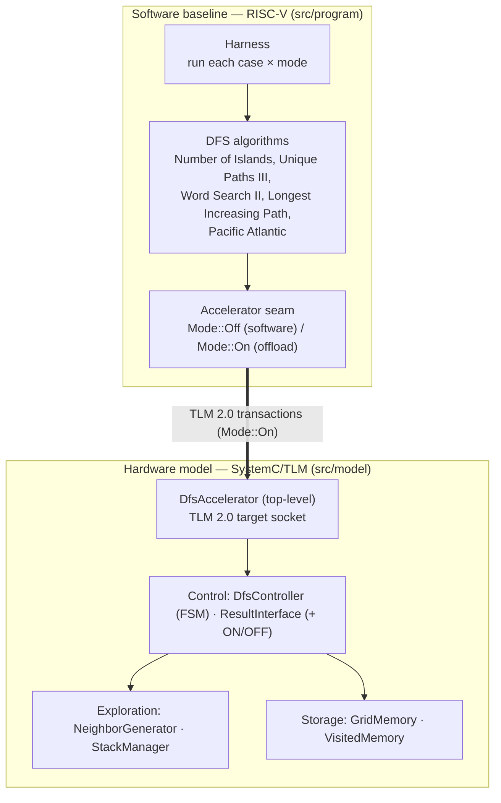
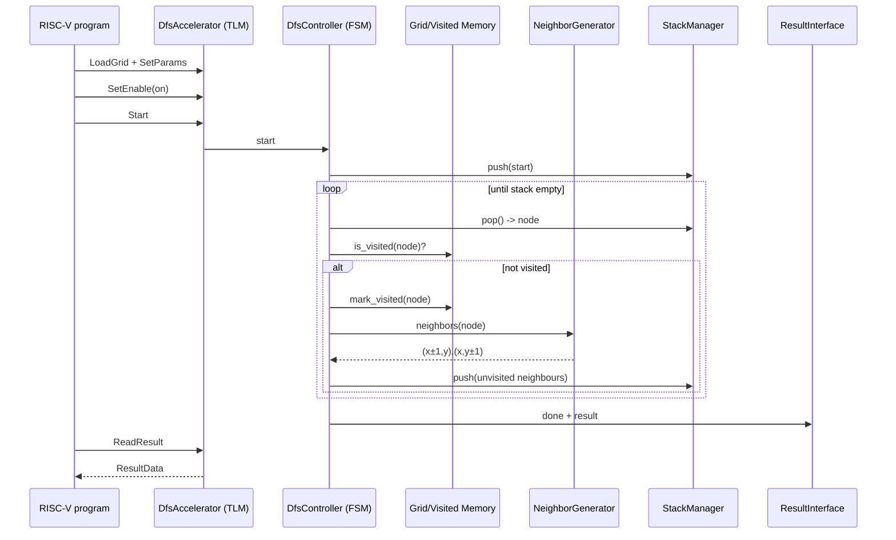

# Architecture Overview

This guide describes the code skeleton that implements the DFS RISC-V hardware
accelerator: how the software baseline and the SystemC hardware model are
organized and how they interact. It complements the
[README architecture sections](../../README.md#module-organization) and the
paper's *Proposed Solution* ([docs/paper/](../paper/)).

> **Status:** the modules below are architecture skeletons — boundaries, ports,
> and the TLM interface are defined; behaviour is stubbed with `TODO(<issue>)`
> markers. See issues #18–#35 for the implementation breakdown.

## High-level view

The system has two halves that meet at a TLM 2.0 interface:

- **Software baseline** (`src/program/`) — bare-metal C++ compiled for RISC-V.
  Runs the five DFS problems and the measurement harness.
- **Hardware model** (`src/model/`) — the SystemC/TLM 2.0 model of the
  accelerator the software can offload to.

The accelerator can be toggled ON/OFF at runtime, so every test case runs twice
on the same model — once on the plain RISC-V core, once through the accelerator —
and both runs are compared metric by metric.



## Software layers (`src/program/`)

| Layer | Files | Responsibility |
|---|---|---|
| Entry point | `main.cpp` | Builds the harness and reports metrics |
| Harness | `harness/harness.{h,cpp}` | Runs every (case, mode), validates, records `RunMetrics` |
| Metrics | `harness/metrics.h` | Latency (`sc_time`), instruction count, throughput, visited cells, expanded nodes, peak stack depth |
| Accelerator seam | `harness/accelerator.h` | Abstract DFS primitives (`is_visited`, `mark_visited`, `neighbors`, …) resolved in software or on hardware depending on `Mode` |
| Algorithms | `algorithms/dfs_algorithm.h` + `algorithms/<problem>/` | `DfsAlgorithm::solve(case, accel)` — one subclass per problem |
| Cases | `cases/test_case.h` | Case format (grid, start, params, expected result) + `CaseLoader` |
| Shared types | `dfs_types.h` | `Coord`, `Grid`, `AlgoResult` |

The seam is the key design point: the algorithm code is written once, and the
same call path runs either fully in software (`Mode::Off`) or issues the DFS
primitives to the accelerator over TLM (`Mode::On`).

## Hardware modules (`src/model/`)

The accelerator mirrors the three stages of the paper's proposed architecture.

| Stage | Module | Responsibility |
|---|---|---|
| Top-level | `DfsAccelerator` | Single TLM 2.0 target socket; decodes host transactions against the memory map; interconnects the modules |
| Control | `DfsController` | FSM: pop node → mark visited → generate neighbours → push unvisited → repeat until the stack is empty |
| Control | `ResultInterface` | Latches the result for the host; hosts the ON/OFF toggle |
| Exploration | `NeighborGenerator` | Produces the 4/8 neighbours of `(x,y)` with boundary handling |
| Exploration | `StackManager` | LIFO of unexplored nodes; tracks peak depth |
| Storage | `GridMemory` | Read-only input grid, loaded by the host |
| Storage | `VisitedMemory` | Per-cell visited state, cleared at run start (multiple instances for algorithms needing more than one set) |

Configuration lives under `src/model/config/`: `memory_map.h` (host-visible
registers), `tlm_protocol.h` (command set / transaction format), and
`accelerator_config.h` (compile-time bounds). Shared value types are in
`utils/types.h`.

## Traversal flow (accelerated path)



## Build

Both halves build inside the dev container (SystemC 2.3.4 pre-compiled, RISC-V
cross-compiler installed):

```bash
make model     # src/model  -> build/sim  (SystemC, host C++)
make program   # src/program -> build/program (RISC-V ELF)
make run       # builds both and runs sim with the program binary
```

See the [README build instructions](../../README.md#requirements--build-instructions)
for the full toolchain matrix.
