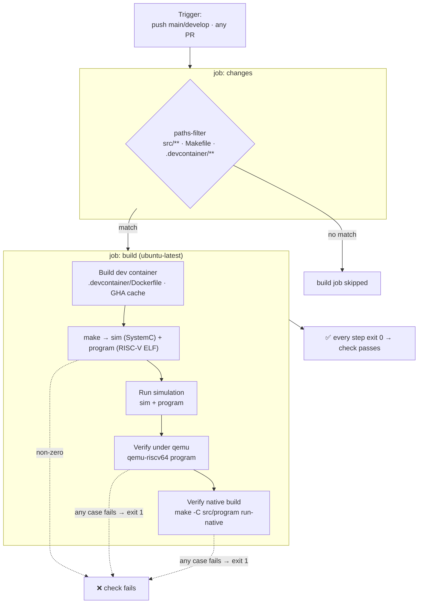
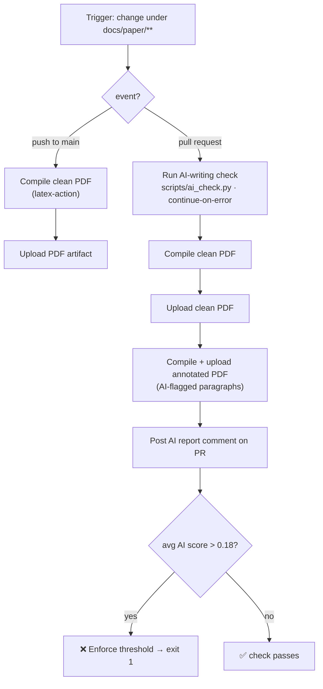

# CI/CD

Two GitHub Actions workflows guard the repository. Each step runs to a non-zero
exit code on failure, so a red check means a concrete gate failed.

- **[build.yml](../../.github/workflows/build.yml)** — the code CI: builds the dev
  container, the SystemC model and the RISC-V program, then verifies the program
  **two ways** (RISC-V emulation and native build).
- **[paper.yml](../../.github/workflows/paper.yml)** — the paper CI: compiles the
  IEEE PDF and, on pull requests, runs an AI-writing gate.

## Code CI — `build.yml`

Triggered on every push to `main`/`develop` and on every pull request. A
`paths-filter` gate runs the heavy job **only** when `src/**`, `Makefile`, or
`.devcontainer/**` changed, so doc-only changes skip it.

### How it verifies

| Step | What it proves |
|---|---|
| Build dev container | The environment (RISC-V cross-compiler, SystemC, qemu, native toolchain) builds reproducibly |
| `make` | The SystemC model **and** the RISC-V program compile (cross-compilation works) |
| Run simulation | The SystemC executable elaborates and runs |
| **qemu emulation** | The RISC-V binary runs on a RISC-V target and all 42 case runs pass — exit 1 on any mismatch |
| **native build** | The algorithm logic is correct independent of cross-compilation — same 42 runs, exit 1 on any mismatch |

The program's `main` returns non-zero if any case fails validation, so the last two
steps are the functional test gate: the code must be correct in **both** RISC-V
emulation and a native build for the check to go green.

## Paper CI — `paper.yml`

Triggered only when `docs/paper/**` (or the workflow / AI-check script) changes.
A push to `main` builds the clean PDF; a pull request also runs the AI-writing gate
and posts an annotated report.

### How it verifies

| Step | What it proves |
|---|---|
| Compile clean PDF | The LaTeX source builds; the PDF is uploaded as a downloadable artifact |
| AI-writing check (PR) | Runs a local detector (`desklib/ai-text-detector`, not Turnitin) over the prose |
| Post report + annotated PDF | Surfaces flagged paragraphs on the PR for review |
| Enforce threshold | Fails the PR if the average AI score exceeds **0.18** (a margin below the 20% rule) |

The AI check is a free, local proxy — no API key or secret. It computes per-paragraph
scores, comments them on the PR with an annotated PDF, and blocks merge only when the
average crosses the threshold.
