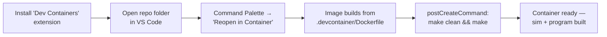

# Environment Setup & Build (`make model`, `make program`, `make run`)

How to reproducibly stand up the toolchain and build both halves of the project:
the SystemC hardware model (`src/model/`) and the bare-metal RISC-V program
(`src/program/`). This guide complements the
[README build instructions](../../README.md#requirements--build-instructions) and
the [software pipeline guide](software-pipeline.md).

Closes #47.

## Why the dev container

The two sub-builds need two different toolchains:

| Target | What it builds | Toolchain |
|---|---|---|
| `make model` | `src/model/` — SystemC simulation (`sim`) | host GCC ≥ 9 / Clang ≥ 10 (C++17) + CMake ≥ 3.16 |
| `make program` | `src/program/` — bare-metal RISC-V binary | `riscv64-unknown-elf-gcc`/`g++` + CMake ≥ 3.16 |

The RISC-V cross-compiler **only** ships inside the dev container image — it is
not something you install by hand — so the dev container is the recommended
(and CI-verified) path. `SystemC 2.3.4` is also pre-built in the image, so
`make model` doesn't need network access to fetch it via `FetchContent`.

## Option A — VS Code Dev Containers (recommended)



1. Install the [Dev Containers](https://marketplace.visualstudio.com/items?itemName=ms-vscode.remote-containers) extension.
2. Open the repository root in VS Code.
3. Command Palette → **Dev Containers: Reopen in Container**.
4. VS Code builds the image from [`.devcontainer/Dockerfile`](../../.devcontainer/Dockerfile)
   and runs `postCreateCommand` (`make clean && make`) automatically — so on
   first open you already have `sim` and `program` built.
5. Extensions listed in [`devcontainer.json`](../../.devcontainer/devcontainer.json)
   (C/C++, CMake Tools, Makefile Tools, GitHub Actions, Copilot) install
   automatically inside the container.

> The CMake build directory used by `ms-vscode.cpptools`/CMake Tools is
> `src/model/build` (set via `cmake.buildDirectory` in `devcontainer.json`).
> IntelliSense config for the C++ layer lives in
> [`.vscode/c_cpp_properties.json`](../../.vscode/c_cpp_properties.json), which
> points at that same `compile_commands.json`.

## Option B — Docker CLI

Same image, no editor required — useful for a quick check or a headless
machine:

```bash
docker build -t dfs-riscv .devcontainer/
docker run -it --rm -v $(pwd):/workspace -w /workspace dfs-riscv make run
```

- `docker build` uses [`.devcontainer/Dockerfile`](../../.devcontainer/Dockerfile)
  (Ubuntu 22.04 + cross-compiler + qemu-user + LaTeX + pre-built SystemC at
  `/opt/systemc`).
- `docker run ... make run` mounts the repo, builds both sub-projects, and runs
  the simulation with the program binary as input in one shot.

This is exactly the path CI ([`build.yml`](../../.github/workflows/build.yml))
follows, so if it works locally it should stay green in Actions.

## Option C — GitHub Codespaces

Same `devcontainer.json` works with no changes: open the repo on GitHub → **Code**
→ **Codespaces** → **Create codespace on main**. Codespaces builds the same
image and runs the same `postCreateCommand`.

## Option D — Local build (no container)

Only recommended if you already have a RISC-V cross-compiler installed, or you
only need `make model` / `make paper` (which don't need it).

```bash
git clone <repository-url>
cd <repository>
make            # builds model + program
make run        # builds both and runs sim, passing it the program binary
make clean      # cleans model + program build dirs
make paper        # builds docs/paper/main.pdf
make paper-clean  # removes LaTeX build artifacts
```

- If SystemC is already installed on your machine, `export SYSTEMC_HOME=/path/to/systemc`
  before running `make` — this skips the `FetchContent` download in
  [`src/model/CMakeLists.txt`](../../src/model/CMakeLists.txt).
- Without `SYSTEMC_HOME` set, CMake fetches and builds SystemC 2.3.4 from source
  (requires internet access), which is slower than using the dev container's
  pre-built copy.
- `make program` will fail here unless `riscv64-unknown-elf-gcc`/`g++` is on
  your `PATH` — this is the toolchain that's only guaranteed inside the dev
  container.

## Verifying the build worked

```bash
make model                          # builds src/model/build/sim
make program                        # builds src/program/build/program
./src/model/build/sim src/program/build/program   # run the simulation
```

You should see the per-case metrics report from the harness
(see [software-pipeline.md](software-pipeline.md#pipeline)), ending in exit code
`0` if every case passed. Inside the dev container / CI you can additionally
check the program on its own, in both modes:

```bash
qemu-riscv64 ./src/program/build/program   # RISC-V emulation
make -C src/program run-native             # native build, same 42 case runs
```

Both must exit `0` — this is exactly what
[`build.yml`](../../.github/workflows/build.yml) checks on every push/PR that
touches `src/`, `Makefile`, or `.devcontainer/`. See the
[CI/CD guide](ci-cd.md) for the full flow diagram.

## Troubleshooting

| Symptom | Likely cause | Fix |
|---|---|---|
| `make program` fails with `riscv64-unknown-elf-gcc: command not found` | Not inside the dev container | Use Option A/B/C, or install the cross-compiler yourself |
| `make model` hangs / fails to fetch SystemC | No network access, `SYSTEMC_HOME` unset | Use the dev container (pre-built at `/opt/systemc`), or set `SYSTEMC_HOME` |
| CMake Tools / IntelliSense can't find `compile_commands.json` | Build dir not yet generated | Run `make model` once — it's created at `src/model/build/compile_commands.json` |
| `make run` succeeds locally but CI's `build.yml` is red | Local env has extra tools not in the Docker image | Reproduce with Option B (Docker CLI) — it's the same image CI uses |
