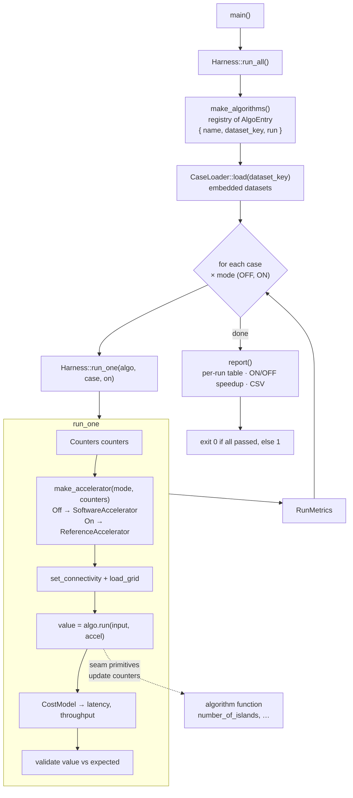

# Software Pipeline (`src/program/`)

How the RISC-V software baseline runs: it takes the five DFS problems, runs each
test case twice — once with the accelerator **OFF** (plain software) and once
**ON** (primitives offloaded to the modelled accelerator) — validates every result
against its expected value, and prints a comparative metrics report. The program
returns a non-zero exit code if any case fails, so a run doubles as the test suite.

This guide documents the pipeline for contributors. For the module layout of the
whole project see [architecture.md](architecture.md).

## Pipeline



## Steps

1. **`main()`** builds a `Harness` and calls `run_all()`, then passes the metrics to
   `report()` and returns its pass/fail as the exit code.
2. **`make_algorithms()`** ([algorithms/dfs_algorithm.cpp](../../src/program/algorithms/dfs_algorithm.cpp))
   is the test bench: it returns a list of `AlgoEntry { name, dataset_key, run }`.
   Each `run` is a small adapter that calls the algorithm's free function with its
   problem-specific arguments (e.g. `word_search_ii(grid, words, accel, prune)`).
   Variants like `*_nopruning` and `*_nomemo` reuse a base algorithm's `dataset_key`.
3. **`CaseLoader::load(dataset_key)`** ([cases/datasets.cpp](../../src/program/cases/datasets.cpp))
   returns the cases for that algorithm. Datasets are embedded in code (no file I/O)
   and sized to force best/worst case: 4/8 connectivity, density, size and shape.
4. **Loop:** for every case, `run_one` executes twice — `accelerator_on = false`,
   then `true`.
5. **`run_one`** ([harness/harness.cpp](../../src/program/harness/harness.cpp)) builds
   a fresh `Counters`, constructs the accelerator for the mode, configures it
   (`set_connectivity`, `load_grid`), and calls the algorithm's `run`. It then turns
   the counters into a `RunMetrics` via the `CostModel` and validates the result
   against the case's `expected` value.
6. **The algorithm function** operates only on its input plus the accelerator seam
   (`is_visited`, `mark_visited`, `unmark_visited`, `neighbors`) and a `CountedStack`.
   Every primitive updates the shared `Counters`.
7. **`report()`** ([harness/report.cpp](../../src/program/harness/report.cpp)) prints
   the per-run table, the ON/OFF speedup, and a CSV block for the paper.

## Components

| File | Responsibility |
|---|---|
| `main.cpp` | Entry point: run harness, report, return pass/fail exit code |
| `harness/harness.{h,cpp}` | Drives every (case, mode); builds accelerator, times, validates |
| `algorithms/dfs_algorithm.{h,cpp}` | `AlgoEntry` registry + `make_algorithms()` (the test bench) |
| `algorithms/<problem>/` | One DFS problem as a free function with problem-specific args |
| `harness/accelerator.{h,cpp}` | Seam: `SoftwareAccelerator` (OFF) / `ReferenceAccelerator` (ON) + factory |
| `harness/instrumentation.h` | `Counters`, `CostModel`, `CountedStack` |
| `harness/metrics.h` | `RunMetrics` collected per run |
| `harness/report.{h,cpp}` | Human table + ON/OFF speedup + CSV |
| `cases/test_case.h` | `Problem` (algorithm input) and `TestCase` (`Problem` + `expected`) |
| `cases/datasets.cpp` | Embedded datasets + `CaseLoader` |
| `dfs_types.h` | `Coord`, `Grid`, `Connectivity`, `AlgoResult` |

## Accelerator seam and modes

Every algorithm is written once against the abstract `Accelerator`. The mode only
changes how much each primitive costs:

- **`Mode::Off` — `SoftwareAccelerator`:** each neighbour query charges one op per
  candidate direction (sequential bounds checks).
- **`Mode::On` — `ReferenceAccelerator`:** neighbour generation is parallel, so a
  query charges a single op. This is a behavioural stand-in for the SystemC/TLM
  model; at integration (INT-1) a `TlmAccelerator` replaces it without touching any
  algorithm or the harness.

Results are identical in both modes; only the op count (and thus latency and
throughput) differs.

## Metrics and cost model

`Counters` records `ops` (instruction-count proxy), `expanded_nodes`,
`visited_cells` and `peak_stack_depth`. `CostModel` turns the op count into a
modelled latency (`ops × cycles_per_op × clock_period_ns`, matching the model's
10 ns clock). The accelerator advantage lives in the op count itself, so a single
cost model applies to both modes. This latency is a **model-based estimate**; the
real `sc_time` is reconciled with the SystemC model at INT-1.

## Build and run

Inside the dev container (RISC-V cross-compiler + `qemu-user` + native toolchain):

```bash
make program                    # build the RISC-V ELF (src/program/build/program)
make run-emu                    # RISC-V build, run under qemu-riscv64
make run-native                 # native host build (build-native/program), run
```

CI ([.github/workflows/build.yml](../../.github/workflows/build.yml)) verifies both
paths: the RISC-V binary under qemu emulation, and the native build — both must exit
0 (all cases pass).

## Adding an algorithm or case

- **New algorithm:** add `algorithms/<name>/<name>.{h,cpp}` as a free function taking
  its problem-specific arguments plus `Accelerator&`, register it in
  `make_algorithms()`, and add its `.cpp` to [CMakeLists.txt](../../src/program/CMakeLists.txt).
- **New case:** add it to the matching `*_cases()` in `cases/datasets.cpp` with its
  `expected` value.
